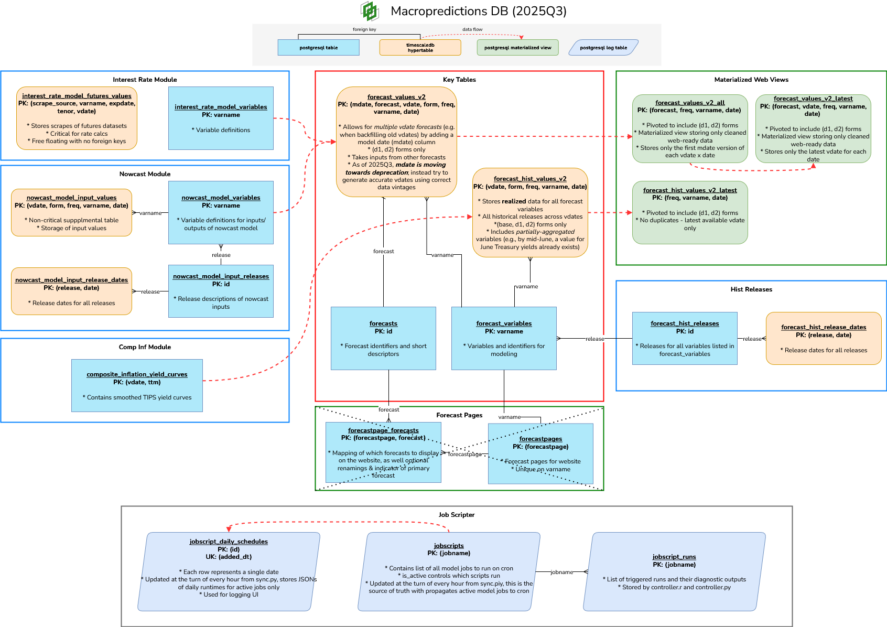

# Macropredictions


This code contains the data aggregation & modeling code used for forecasting and index models in [macropredictions.com](macropredictions.com).

This codebase is primarily created for internal model development, and large parts of it are reliant on being able to connect to internal database and logging systems. However, external users can still adapt most scripts for their own use cases, though it will be necessary to modify any code which relies on calls to internal data sources or files.


## Setup
### Initial steps
1. Clone the repo to some directory, `/path/to/macropredictions`.
2. Install R (4.3.0+) and Python (3.10+) on your system if necessary.
3. Setup and launch a Postgres database, including a user with full CRUD access to all tables on the database. 
4. Create an `.env` file in the project directory. This file should include the below contents: 
	```yaml
	MP_DIR=/path/to/macropredictions
	DB_SERVER=your.db.ip
	DB_PORT=your_db_port
	DB_USERNAME=your_db_user
	DB_PASSWORD=your_db_password
	DB_DATABASE=your_db_name
	```
5. Continue with the instructions below to setup the requisite Python and R environment.

### Python setup
1. Create a Python venv in this project directory: `python3 -m venv .venv`. Use Python 3.10 or later.
2. In the venv's site-packages folder (`$PROJ_DIR/.venv/lib/pythonX.Y/site-packages`), create an `add_path.pth` file. The only content in the file should be the project directory path.
	```
	/path/to/macropredictions
	```
	This will add the the project directory to the PYTHONPATH whenever the venv is active, so that Python modules can always be loaded using a path relative to this directory, and that the env file can be read relative to this directory. You can validate this by running `import sys; print(sys.path)` when running Python3 in the activated venv.
3. Install Python libraries `pip3 install -r requirements.txt`. If this fails, try installing all necessary libraries from scratch: `pip3 install jupyter lab python-dotenv numpy pandas sqlalchemy psycopg2 torch torchaudio torchvision tqdm camelot-py opencv-python requests matplotlib`.

### R setup
1. Create an `.Renviron` file containing the location of your project directory. You can use the bash script below.
	```bash
	PROJ_DIR="/path/to/macropredictions"
	ENV_PATH=$(Rscript -e "cat(file.path(getwd(), '.Renviron'))")
	rm -rf ${ENV_PATH}
	cat <<EOF >${ENV_PATH}
	MP_DIR='${PROJ_DIR}'
	EOF
	echo "----- Complete -----"
	```
You can test this by launching R and verifying that `Sys.getenv('MP_DIR')` returns the expected result.

2. Launch R and install the functions in `r_helpers` as a package. 
	```R
	install.packages(file.path(Sys.getenv('MP_DIR'), 'r_helpers'), repos = NULL, type = 'source')
	```
This package will be available through `library(macropredictions)`.


## For internal users
Please see the wiki pages on [server maintenance](https://wiki.macropredictions.com/books/system-overview/page/server-administration) to setup your dev environment and access GUI interfaces. See [data flow structure](https://wiki.macropredictions.com/books/system-overview/page/data-flow-structure) to understand the data flow between models and data stores.

### Database Structure


### Server Structure


## Usage
**Running module scripts**
1. TBD

(For internal users) You can still call modules directly for testing. However, for productionalizing, cronjobs should instead use `controller.py` (for Python modules) or `controller.r` for R modules.


## Changelog

## v3.1.2 - 2026.01
- **External forecasts**
	- Fixed broken scraping helpers
- **Historical data**
	- Migrated source of AMERIBOR data

## v3.1.1 - 2025.07
- **External forecasts**
	- Deprecated Bloomberg data sources due to BSBY index removal
	- Deprecated futures-based AMB forecasts ingestion due to CBOE discontinuation; replaced with mean-reverting spread over SOFR
	- Added LLM-based multimodal screenshot scrapes for CB
- **Python helpers**
	- Added `async_run` and `SkipRun` helpers to support more Python scripting logic.

### v3.1.0 - 2024.10
- Fixed broken external scrapers
- **Inflation forecasts**
	- Added ttm curve storage
	- Added composite einf-TIPS forecast
- **Rate forecasts**
	- Fixed AMERIBOR forecasts
	- Added 10-2 spreads
	- Added vintage date consistency verification
	- Added real Treasury yields
	- Added term premia smoothing for 3y-5y forward forecasts
	- Switched covariate for TPS model to months_ahead^.5 for greater stability
- **R helpers**
	- Cleaned up unit tests
	- Fixed/deprecated broken scrapers

### v3.0.0 - 2023.11
- Migrated from previous `econforecasting-r` git repo
- Improved the README to be usable
- **R helpers**
    - Migrated R package from `r_package` to `r_helpers`
    - Cleaned out unused/deprecated functions
    - Consolidated code for FRED API calls
    - Added async requests function for high-volume calls
- **Python controller**
    - Added Python script controller and top-level `py_helpers` module
    - Added db helpers for Python
- **Text indices**
    - Cleaned up text data scrape code
    - Added code for calling LLM labelers for generating BERT training labels
    - Added BERT finetuning code with PEFT
    - Added BERT inference code
    - Added index construction & backtesting
